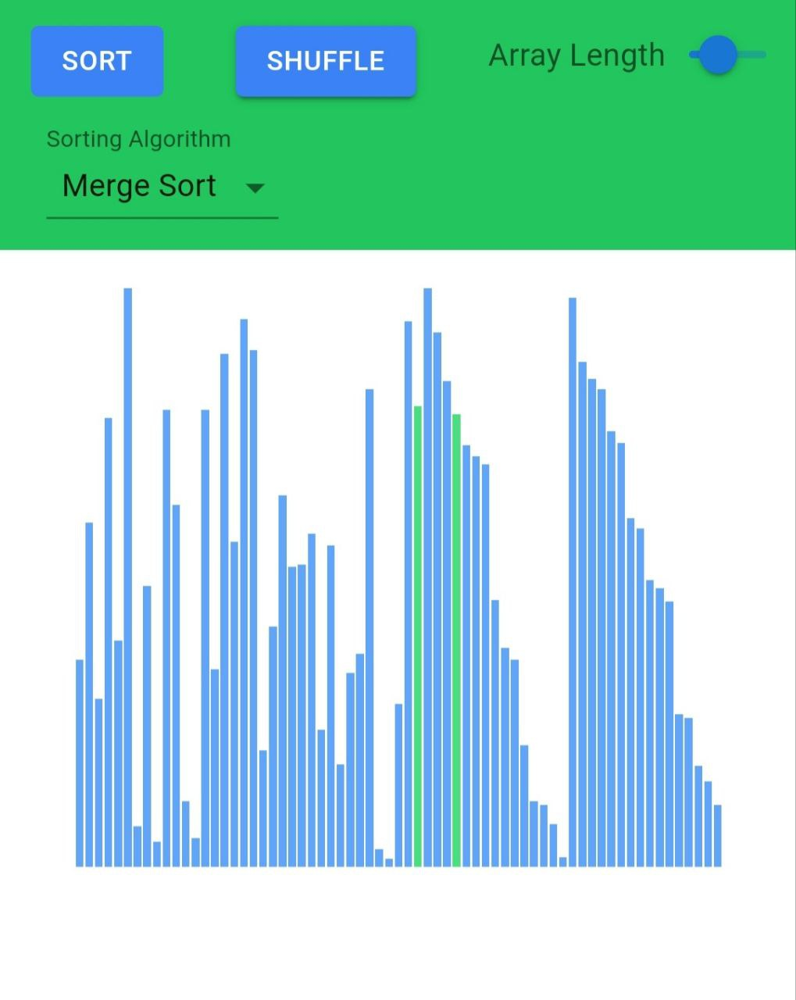

# Sorting algorithm Visualizer

This web app lets you see how lists get sorted using different sorting algorithms.

## See Live

Go to this [link](https://sort-algorithms-visualizer.vercel.app/)

## Features

- Select between 5 sorting algorithms
  1. QuickSort
  2. MergeSort
  3. HeapSort
  4. SelectionSort
  5. BubbleSort
- You can adjust the speed and number of elements
- Uses different colors for different events: comparison, swap, movement

## Learn More About Sorting

- [Javascript Algorithms Repo](https://github.com/trekhleb/javascript-algorithms)
- [Coding Interview University](https://github.com/jwasham/coding-interview-university#sorting)
